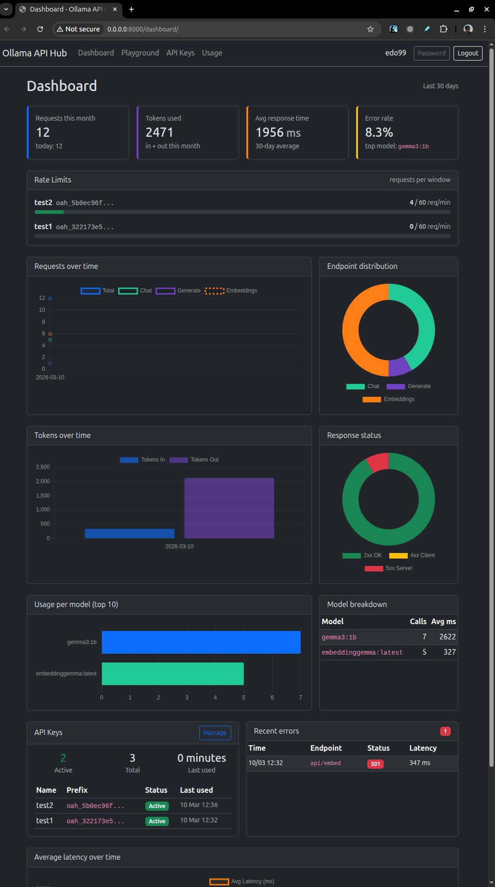
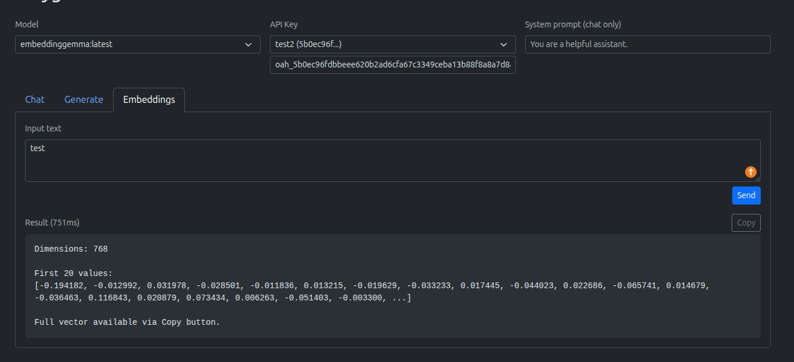

# LLamaPass

A self-hosted API gateway for [Ollama](https://ollama.com) with multi-user support, API key management, rate limiting, and usage tracking. Built with Django.

## Screenshots

### Dashboard


### Test



### API Keys


### Usage Guide


## Features

- **Multi-user** — User registration, login, password change
- **API key management** — Create, revoke, and manage keys with optional expiration
- **Model restrictions** — Per-key allowed models via checkbox selection from available Ollama models
- **Rate limiting** — Per-key configurable rate limits with dashboard monitoring
- **Usage tracking** — Dashboard with 30-day stats, daily breakdown by key (calls, tokens, status codes)
- **Test page** — Built-in UI to test Chat, Generate, and Embeddings endpoints
- **Proxy gateway** — Transparent proxy to Ollama with streaming support, respects `"stream": false`
- **Usage guide** — Built-in page with curl, Python (OpenAI SDK, requests) examples and copy-to-clipboard
- **Authentication** — Supports `Authorization: Api-Key`, `Authorization: Bearer` (OpenAI SDK compatible), and `X-API-Key` headers
- **Admin-only endpoints** — Pull, push, create, delete, copy restricted to staff users
- **Docker ready** — Docker Compose with Redis for production-grade rate limiting
- **Dark mode** — Bootstrap 5.3 dark theme

## Quick Start

### Docker (recommended)

```bash
git clone https://github.com/edoardoted99/llamapass.git
cd llamapass
cp .env.example .env  # edit SECRET_KEY
docker compose up --build
docker compose exec web python manage.py createsuperuser
```

The app runs at `http://localhost:8000`. Ollama must be running on the host machine.

### Local development

```bash
git clone https://github.com/edoardoted99/llamapass.git
cd llamapass
python -m venv .venv
source .venv/bin/activate
pip install -r requirements.txt
cp .env.example .env  # edit as needed
python manage.py migrate
python manage.py createsuperuser
uvicorn config.asgi:application --host 0.0.0.0 --port 8000
```

## Configuration

Edit `.env`:

| Variable | Default | Description |
|---|---|---|
| `SECRET_KEY` | `insecure-dev-key-change-me` | Django secret key |
| `DEBUG` | `False` | Debug mode |
| `ALLOWED_HOSTS` | `localhost,127.0.0.1` | Comma-separated hosts |
| `CSRF_TRUSTED_ORIGINS` | `` | Comma-separated origins |
| `OLLAMA_UPSTREAM_BASE_URL` | `http://127.0.0.1:11434` | Ollama server URL |
| `ENABLE_STREAMING` | `True` | Enable streaming responses |
| `DEFAULT_RATE_LIMIT` | `60/min` | Default rate limit per key |
| `LOG_RETENTION_DAYS` | `30` | Days to keep request logs |
| `REDIS_URL` | `` | Redis URL (empty = in-memory cache) |
| `DATABASE_PATH` | `./db.sqlite3` | SQLite database path |

## API Usage

After creating an API key in the web UI:

```bash
curl http://your-server/ollama/api/chat \
  -H "Authorization: Api-Key oah_your_key_here" \
  -d '{
  "model": "gemma3:1b",
  "messages": [{"role": "user", "content": "Hello!"}],
  "stream": false
}'
```

OpenAI SDK compatible:

```python
from openai import OpenAI

client = OpenAI(
    base_url="http://your-server/ollama/v1",
    api_key="oah_your_key_here",
)

response = client.chat.completions.create(
    model="gemma3:1b",
    messages=[{"role": "user", "content": "Hello!"}],
)
print(response.choices[0].message.content)
```

## Tech Stack

- Django 5.1 + uvicorn (ASGI)
- httpx (async proxy)
- Redis (rate limiting via django-redis)
- Bootstrap 5.3 (dark mode)
- SQLite (default)
- Docker + Docker Compose
