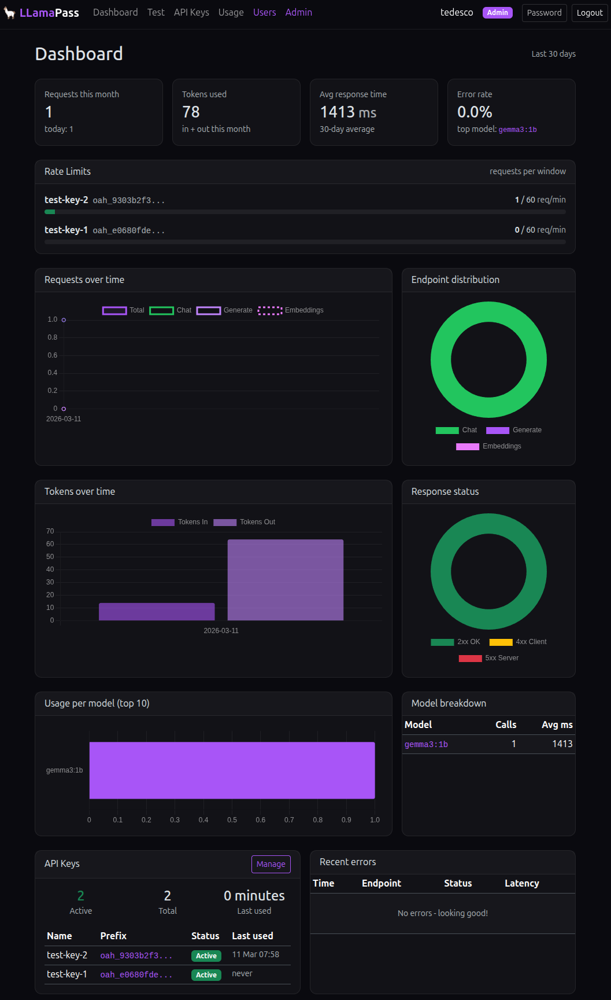
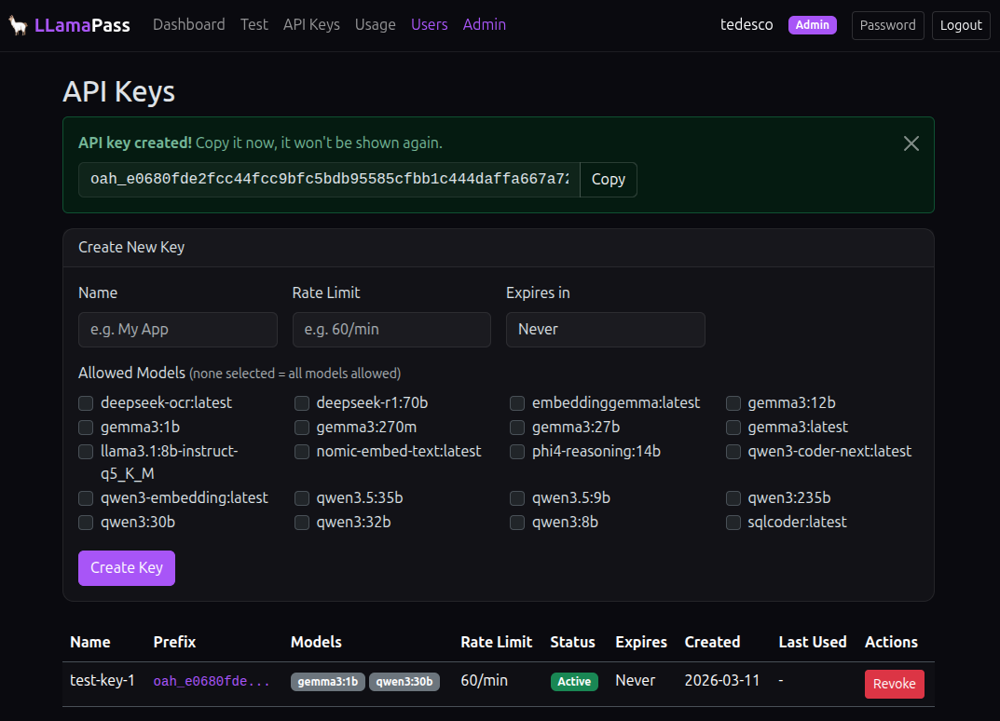
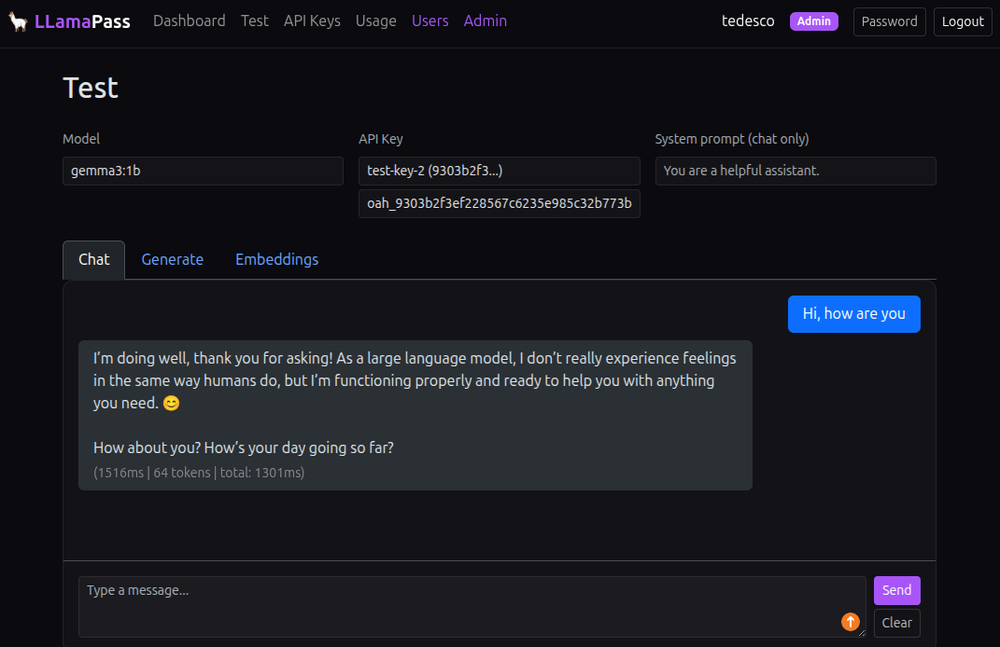
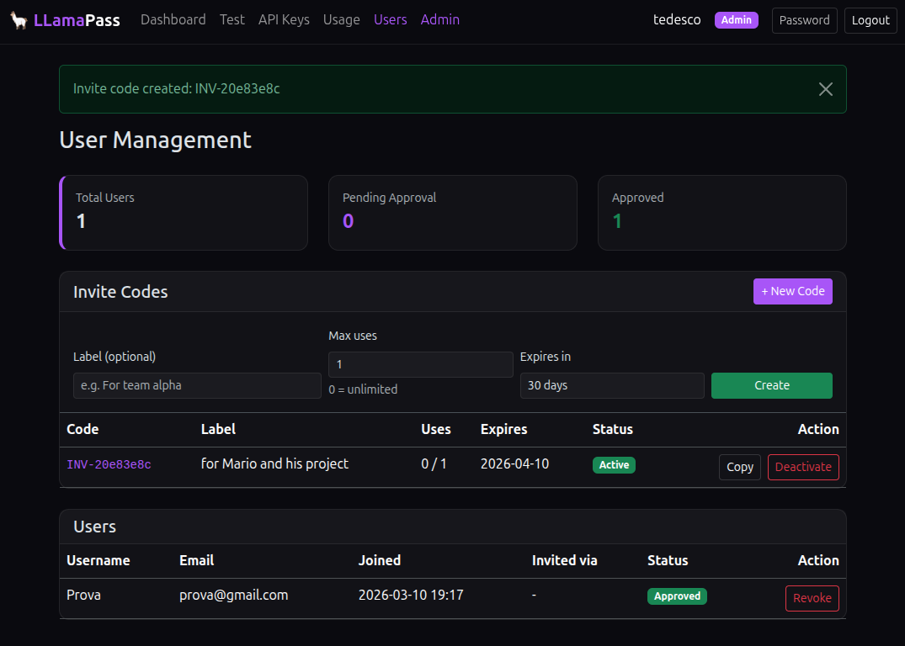
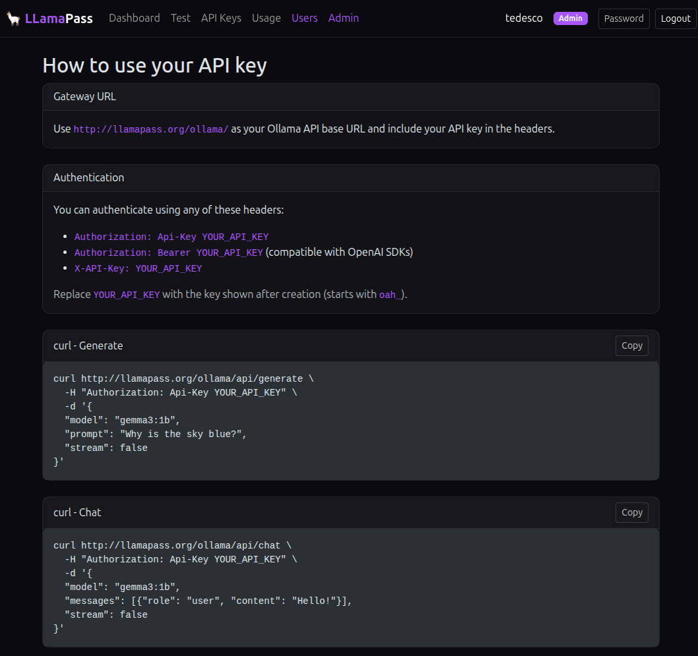

# LLamaPass

A self-hosted API gateway for [Ollama](https://ollama.com) with multi-user support, API key management, rate limiting, and usage tracking. Built with Django.

## Screenshots

### Landing Page & Dashboard


### API Keys


### Built-in Chat Test


### User Management & Invite Codes


### Usage Guide


## Features

- **Multi-user with admin approval** — Registration with invite codes for instant access, or manual admin approval
- **Invite codes** — Admins generate invite codes with max uses and expiration to control who joins
- **API key management** — Create, revoke, set expiration (7d–1y), per-key model restrictions
- **Rate limiting** — Configurable per-key limits (e.g. `60/min`, `1000/hour`) with live dashboard monitoring
- **Usage dashboard** — 30-day stats with charts: requests, tokens, latency, errors, model breakdown
- **Test page** — Built-in UI to test Chat, Generate, and Embeddings endpoints directly from the browser
- **Proxy gateway** — Transparent async proxy to Ollama with streaming support
- **Usage guide** — Copy-paste examples for curl, Python (OpenAI SDK, requests)
- **Authentication** — `Authorization: Api-Key`, `Authorization: Bearer` (OpenAI SDK compatible), `X-API-Key`
- **Admin-only endpoints** — Pull, push, create, delete, copy restricted to staff users
- **Docker ready** — Docker Compose with Redis for production-grade rate limiting
- **Dark theme** — Custom dark purple theme across the entire app

## Quick Start

### Docker (recommended)

```bash
git clone https://github.com/edoardoted99/llamapass.git
cd llamapass
cp .env.example .env  # edit SECRET_KEY
docker compose up --build
docker compose exec web python manage.py createsuperuser
```

The app runs at `http://localhost:8000`. Ollama must be running on the host machine.

### Local development

```bash
git clone https://github.com/edoardoted99/llamapass.git
cd llamapass
python -m venv .venv
source .venv/bin/activate
pip install -r requirements.txt
cp .env.example .env
python manage.py migrate
python manage.py createsuperuser
uvicorn config.asgi:application --host 0.0.0.0 --port 8000
```

## Configuration

Edit `.env`:

| Variable | Default | Description |
|---|---|---|
| `SECRET_KEY` | `insecure-dev-key` | Django secret key |
| `DEBUG` | `False` | Debug mode |
| `ALLOWED_HOSTS` | `localhost,127.0.0.1` | Comma-separated hosts |
| `CSRF_TRUSTED_ORIGINS` | `` | Required if behind HTTPS proxy (e.g. `https://yourdomain.com`) |
| `OLLAMA_UPSTREAM_BASE_URL` | `http://127.0.0.1:11434` | Ollama server URL |
| `ENABLE_STREAMING` | `True` | Enable streaming responses |
| `DEFAULT_RATE_LIMIT` | `60/min` | Default rate limit per key |
| `LOG_RETENTION_DAYS` | `30` | Days to keep request logs |
| `REDIS_URL` | `` | Redis URL (empty = in-memory cache) |
| `DATABASE_PATH` | `./db.sqlite3` | SQLite database path |

## API Usage

Create an API key from the web UI, then:

```bash
curl http://localhost:8000/ollama/api/chat \
  -H "Authorization: Bearer oah_your_key_here" \
  -d '{
  "model": "gemma3:1b",
  "messages": [{"role": "user", "content": "Hello!"}],
  "stream": false
}'
```

OpenAI SDK compatible:

```python
from openai import OpenAI

client = OpenAI(
    base_url="http://localhost:8000/ollama/v1",
    api_key="oah_your_key_here",
)

response = client.chat.completions.create(
    model="gemma3:1b",
    messages=[{"role": "user", "content": "Hello!"}],
)
print(response.choices[0].message.content)
```

## Tech Stack

- Django 5.1 + uvicorn (ASGI)
- httpx (async proxy)
- Redis + django-redis (rate limiting)
- Bootstrap 5.3 + custom dark purple theme
- SQLite
- Docker + Docker Compose
